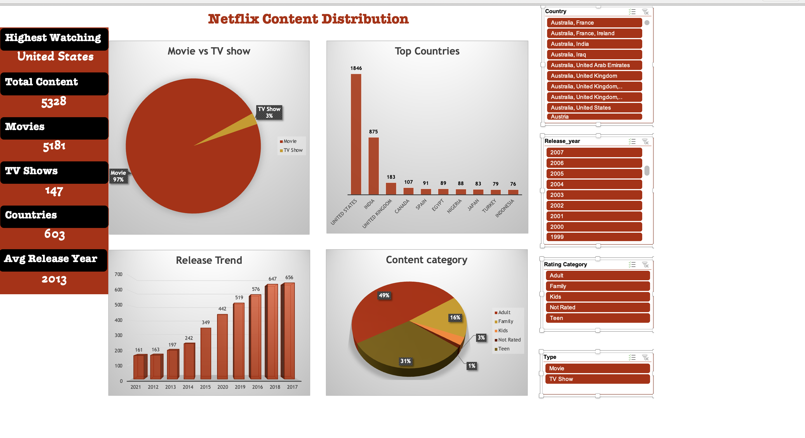

# Netflix Content Analytics Dashboard

## Objective

Build an interactive Excel dashboard to analyze Netflix content.

## Tools

- Microsoft Excel

- Pivot Tables

- Pivot Charts

- Structured References

- Lookup Tables

- KPI Cards

- Slicers

- Timelines

## Workflow

Raw Data

→ Transformations

→ Lookups

→ Pivot Tables

→ Dashboard

## Dashboard Features

- Dynamic updates

- Interactive filtering

- KPI tracking

- Automated reporting

## Screenshots

## Dataset

Netflix Titles Dataset

## Author

Avinash Kumar

Data Analytics Portfolio Project